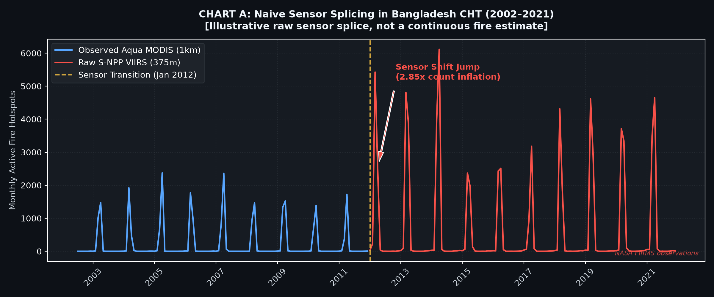
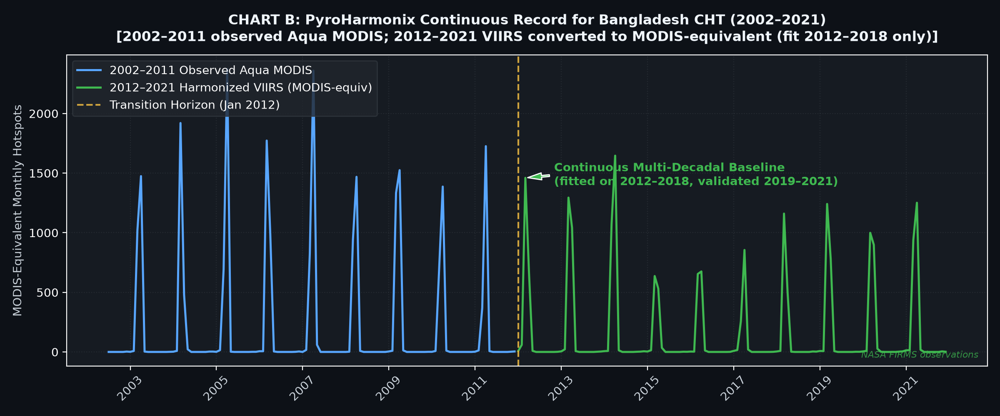
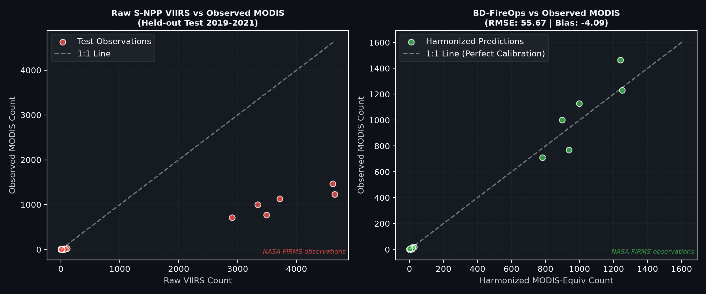

# BD-FireOps: An Uncertainty-Aware MODIS-VIIRS Fire Record for Bangladesh CHT

**NASA Space Apps Challenge 2026**  
**Challenge:** Harmonization of MODIS and VIIRS Hot Spots  
**Team Name:** Claude Fable 7.0 (Dhaka Local Chapter, Bangladesh)  
**Study Domain:** Chittagong Hill Tracts (CHT), Bangladesh (`91.9° - 92.9°E, 21.4° - 23.8°N`)  

[](https://www.python.org/)
[](https://firms.modaps.eosdis.nasa.gov/)
[](LICENSE)

---

## 1. Executive Summary & The 2026 Operational Transition Crisis

For over two decades, NASA’s MODIS sensors aboard the Terra (launched December 1999) and Aqua (launched May 2002) satellites provided the global foundation for active fire and wildfire tracking. NASA projects **end-of-science activities for Terra in February 2027 and Aqua in September 2027** (NASA Earth Observatory, Dec 2025 — mission-status updates shift these dates), and **Suomi-NPP VIIRS data delivery permanently ceasing on November 1, 2026 (NOAA/NASA announcement)**. The Earth science and disaster management communities therefore face an imminent, multi-decadal data discontinuity.

Transitioning directly to VIIRS (375 m) introduces severe spatial and energetic biases. Because VIIRS detects significantly smaller sub-pixel fires than MODIS (1 km), a naive splicing of their records across the 2012 transition produces a **several-fold artificial inflation in fire frequency** (measured for our CHT window in §2). This jump reflects sensor characteristics, not actual climate or fire regime changes.

**BD-FireOps** delivers a held-out-tested, region-specific harmonization prototype designed to estimate a continuous, jump-free MODIS-equivalent monthly fire record for the **Chittagong Hill Tracts (CHT), Bangladesh**, where seasonal Jhum (shifting cultivation) and forest clearing generate significant burning activity (Farukh et al., 2023).


<!-- BEGIN:SUPPORTED_METRICS -->
## 2. Quantitative Validation Results (Held-Out Test Set: 2019–2021)

> **Data source:** NASA FIRMS Area API (MODIS_SP, VIIRS_SNPP_SP) over CHT — see `data/processed/data_source.json`.
> Every number in this section is generated from `data/processed/metrics.json`
> by `python tools/sync_readme.py` — edit the metrics, not this table.

To prevent data leakage, the harmonization model was trained on **2012-01 to 2018-12 (84 months)**
and evaluated on an independent **held-out test set from 2019-01 to 2021-12 (36 months)**.

| Metric | Naive Sensor Splice (Raw VIIRS) | BD-FireOps (Harmonized Linear) | Performance Improvement |
| :--- | :--- | :--- | :--- |
| **RMSE (Hotspots/month)** | **1,130.64** | **55.67** | **-95.1% Error Reduction** |
| **Bias (Mean Prediction Error)** | **+468.92** | **-4.09** | **-99.1% Bias Reduction** |
| **MAE (Mean Absolute Error)** | **468.92** | **21.56** | **-95.4% Error Reduction** |
| **R-Squared ($R^2$) Score** | **-6.8012** | **0.9811** | **Strong held-out fit** |
| **Spearman Rank Correlation ($\rho$)** | **0.928** | **0.9488** | **Preserves Seasonality** |
| **Log1p variant RMSE (zero-robust check)** | **1,130.64** | **243.95** | **-** |

### Fitted Empirical Calibration Model
$$\text{MODIS}_{\text{equivalent}} = 0.2694 \times \text{VIIRS}_{375\text{m}} + (-1.18)$$

* **Bootstrap 95% Confidence Interval (Slope):** `[0.2296, 0.3202]`
* **Bootstrap 95% Confidence Interval (Intercept):** `[-10.9, 7.87]`
* **Interval width:** ±16.8% of the point slope — the bootstrap here is a *coefficient* interval, not a prediction interval.
* **Chart-A step ratio:** `2.85x` — mean raw VIIRS (2012–2021) ÷ mean MODIS (2002–2011),
  zero months counted on both sides; this is the discontinuity Chart A draws.
* **Same-month sensor ratio:** `3.71x` — mean raw VIIRS ÷ mean MODIS over the *same*
  2012–2021 months, i.e. the sensor sensitivity difference itself.
* **log1p check:** did **not** improve held-out RMSE (243.95 vs 55.67) — reported as a robustness check, not as the chosen model.
* **Confidence-threshold sensitivity:** Keeping low-confidence detections changes the fitted slope `0.2694` → `0.2464` (-8.54%) and held-out RMSE `55.67` → `58.43` (+4.96%, i.e. worse when looser thresholds are kept). Row counts: MODIS 42,716 → 43,792, VIIRS 70,858 → 77,873. The baseline thresholds are therefore the reported configuration; `data/processed/sensitivity.json` holds the numbers.
* **Interpretation:** a fitted *regional empirical relationship* for monthly counts — not a
  universal MODIS↔VIIRS conversion, and not a fire-cause classifier.
* **Zero months:** 57 of 120 overlap months contain a zero
  (57 MODIS / 31 VIIRS); zero months were retained, not dropped.
<!-- END:SUPPORTED_METRICS -->

---

## 3. Visual Artifacts (Chart A vs. Chart B)

### Chart A: Naive Sensor Splicing (The Sensor Jump Failure)

*Figure 1: Direct concatenation of Aqua MODIS (2002–2011) with raw VIIRS (2012–2021) exhibits an abrupt, several-fold artificial spike at the 2012 sensor transition caused by the 375 m spatial footprint — a sensor artefact, not a fire-regime change.*

### Chart B: BD-FireOps Calibrated Continuity

*Figure 2: BD-FireOps reconstructs a continuous, multi-decadal baseline for CHT, successfully bridging the 2012 sensor shift.*

### Chart C: Held-out Test Parity (2019–2021)

*Figure 3: Test set observations. Left shows the severe uncalibrated overestimation of raw VIIRS; right demonstrates BD-FireOps predictions adhering tightly to the 1:1 parity line.*

---

## 4. Repository Structure

```
bd-fireops/
├── analysis/
│   ├── download.py             # NASA FIRMS Area API ingestion (5-day chunks, resume, retries)
│   ├── clean.py                # Confidence / Aqua-reference / bbox / CHT-district gate / duplicates
│   ├── aggregate.py            # Regional monthly counts; zero months kept, gaps stay blank
│   └── model.py                # Time-split training, bootstrap, metrics & chart generation
├── tools/
│   ├── sync_readme.py          # Regenerates the §2 metrics block from metrics.json
│   ├── sync_web.py             # Regenerates app.js/index.html generated blocks (series, model, map cells, boundary, sim defaults)
│   └── sensitivity.py          # Low-confidence-kept robustness run → sensitivity.json
├── data/
│   ├── raw/                    # Raw FIRMS chunk files, <start>_<end>.csv per 5-day window (git-ignored)
│   ├── reference/              # geoBoundaries BGD-ADM2 district polygons (CHT boundary gate)
│   └── processed/              # monthly_harmonized.csv, metrics.json, data_source.json, PNGs
├── dashboard/
│   └── app.py                  # Streamlit interactive web application
├── tests/
│   └── test_pipeline.py        # Synthetic end-to-end fixture (clean → aggregate → audits), no API key
├── .github/workflows/check.yml # CI: sync --check + node --check + fixture pipeline
├── vendor/                     # Leaflet 1.9.4 + Chart.js 4.4.1, vendored (no CDN dependency)
├── probe_firms.py              # Master CLI pipeline runner
├── index.html                  # Standalone client-side Web GIS dashboard
├── style.css                   # NASA space-grade dark CSS design tokens
├── app.js                      # Leaflet mapping and Chart.js interactive controls
├── robots.txt                  # Crawler policy for the deployed static site
├── requirements.txt            # Python dependencies (pinned)
├── vercel.json                 # Static deploy config + security headers (CSP, etc.)
├── SUBMISSION_PORTAL_CONTENT.md# Portal copy-paste text, 4-minute video script, deploy checklist
├── .env.example                # Sample environment configuration for FIRMS MAP_KEY
├── LICENSE                     # MIT (Team Claude Fable 7.0)
└── README.md                   # Complete scientific documentation
```

---

## 5. Quickstart & Reproducibility Instructions

### Prerequisites
* Python 3.10+ (tested on Python 3.14)
* Libraries: `numpy`, `pandas`, `scikit-learn`, `scipy`, `matplotlib`, `requests`, `python-dotenv`, `streamlit`

### Step 1: Install Dependencies
```bash
pip install -r requirements.txt
```

### Step 2: Get a free NASA FIRMS MAP_KEY
```bash
# 1) Register (free, instant): https://firms.modaps.eosdis.nasa.gov/api/map_key/
# 2) Copy the sample env file and paste your key
copy .env.example .env      # Windows  (or: cp .env.example .env)
```
`.env` is git-ignored — never commit your key.

*Data terms:* NASA FIRMS data remains subject to the
[FIRMS data citation & access policy](https://www.earthdata.nasa.gov/data/instruments/firms)
(attribution required; raw bulk redistribution limits apply). This repository ships
derived monthly counts, audit JSON and figures — not the raw chunk files
(`data/raw/` is git-ignored for exactly this reason).

### Step 3: Run Full Analysis Pipeline & Model Validation
```bash
python probe_firms.py --run-all
```
This downloads the CHT fire baseline in 5-day chunks (resume-safe), cleans it
(confidence thresholds, Aqua-only reference sensor, bbox, CHT-district polygon gate, duplicates), aggregates
to regional monthly counts with zero months retained, fits the regression models on
the 2012–2018 training split, computes 2019–2021 held-out metrics, and writes every
figure to `data/processed/`.

Useful variants:
```bash
python probe_firms.py --test       # 1-day API probe: status code + returned columns
python probe_firms.py --demo       # SIMULATED data end-to-end (labelled everywhere)
python probe_firms.py --metrics    # print the saved metrics.json
python tools/sync_readme.py        # refresh the §2 numbers after any run
python tools/sync_readme.py --check  # fail if README is stale (CI/pre-commit)
```

### Step 4: Launch Interactive Streamlit Dashboard
```bash
python -m streamlit run dashboard/app.py
```
Or open `index.html` in any modern web browser for the zero-dependency Leaflet/Chart.js Web GIS console.

### Data provenance
Every run records what produced it in `data/processed/data_source.json`
(`kind: nasa_firms_api` or `kind: demo`). The same flag appears in `metrics.json`,
as a watermark on every chart, and in the §2 banner above. Real NASA data must drive
the final submission; demo output exists only to exercise the pipeline before a
MAP_KEY is available.


---

## 6. Data & Method

**Data.** Active-fire detections come from the **NASA FIRMS Area API** over a CHT search window
(`91.9,21.4,92.9,23.8`), pulled in 5-day chunks (the API's maximum `DAY_RANGE`) for two
standard-processing sources. The rectangle also covers parts of India (Mizoram) and Myanmar
(Rakhine), so cleaning keeps only detections inside the **Bandarban / Rangamati / Khagrachhari
district polygons** (geoBoundaries BGD-ADM2, BBS/OCHA, CC BY 3.0 — `data/reference/`);
<!-- BEGIN:REGION_GATE -->54,300 MODIS and 85,857 VIIRS bbox rows outside the CHT were removed<!-- END:REGION_GATE -->:

| Role | Source | Instrument | Window |
| :--- | :--- | :--- | :--- |
| Reference | `MODIS_SP` | MODIS 1 km, filtered to **Aqua** (afternoon crossing) | 2002-07 → 2021-12 |
| Target | `VIIRS_SNPP_SP` | VIIRS 375 m, Suomi-NPP | 2012-01 → 2021-12 |

*Data citation:* NASA FIRMS. MODIS/VIIRS Active Fire and Thermal Anomalies, NASA Earthdata.
Accessed 2026 via the FIRMS Area API. Detection algorithms: Giglio et al. (2016) for MODIS;
Schroeder et al. (2014) for VIIRS 375 m.

**Method.**

1. **Clean** (`analysis/clean.py`) — MODIS confidence ≥ 30, VIIRS low-confidence (`l`) dropped,
   Aqua-only reference gate, bounding-box filter, **CHT district-polygon gate** (drops the
   India/Myanmar fringe of the rectangle), de-duplication; every drop is counted into
   `clean_audit_baseline.json`.
2. **Aggregate** (`analysis/aggregate.py`) — regional **monthly** detection counts. Zero months
   inside coverage are kept as `0`; months outside coverage stay blank.
3. **Fit & validate** (`analysis/model.py`) — ordinary least squares and a log1p variant,
   fitted on **2012–2018**, evaluated on the **held-out 2019–2021** split; slope/intercept
   uncertainty from a **500-resample bootstrap** (a coefficient interval — not a prediction
   interval).

**What this is (and is not).**

> **BD-FireOps is a region-specific, held-out-tested harmonization prototype for estimating
> MODIS-equivalent monthly fire activity from VIIRS observations in an approximate Bangladesh
> CHT study area.**
>
> **Not a claim:** not a universal MODIS–VIIRS conversion, not a fire-cause classifier, and not
> proof of fire absence.

---

## 7. Honest Scientific Scope & Limitations

In accordance with NASA Open Science principles, BD-FireOps explicitly documents all operational boundaries:

1. **Region-Specific Empirical Scope:**  
   BD-FireOps is fitted specifically to the Chittagong Hill Tracts (CHT), Bangladesh. It is **not** a universal global conversion model. Transferring these coefficients to Boreal forests or Australian savannas without regional refitting would introduce bias. It is a **held-out-tested prototype**, not a peer-reviewed operational product.
2. **Aggregation Level (method limitation):**  
   Regional monthly counts, not paired fire-level detections. No overpass-time, scan-angle, exact administrative boundary, land-cover or FRP modeling. Sub-pixel scan-angle distortions and diurnal overpass offsets were not explicitly modeled in this MVP.
3. **Zero & Gap Handling:**  
   Months inside a sensor's coverage window with no detection are retained as `0`; months outside coverage (delivery/orbital gaps) are left blank rather than reported as fire-free. Confidence thresholds are applied per sensor (MODIS ≥ 30, VIIRS low-confidence dropped); the alternative threshold choice is reproduced with `python analysis/clean.py --sensitivity`, and its effect on the *fitted* coefficients is measured with `python tools/sensitivity.py` (numbers in §2 and in `data/processed/sensitivity.json`).
4. **Detection Caveat (data limitation):**  
   FIRMS reports positive detections. A missing detection may reflect cloud, viewing geometry, algorithm sensitivity or no observation. BD-FireOps does **not** classify fire cause (agricultural, forest, or otherwise) — it only estimates a harmonized detection count.
5. **Sensor Transition Roadmap:**  
   Suomi-NPP VIIRS delivery permanently ceases on **1 November 2026** — the record therefore needs a refit against **NOAA-20 (VJ114) / NOAA-21 (VJ214)** before it can be extended past 2021. NASA projects Terra/Aqua MODIS end-of-science for Feb/Sep 2027.

---

## 8. Future Work

1. **NOAA-20 / NOAA-21 refit** — repeat the overlap fit across VIIRS generations once S-NPP ends, so the record continues past 2021.
2. **Grid matching** — compare on a common spatial grid instead of region-level counts.
3. **Overpass timing & scan-angle correction** — model the ~13:30 vs ~13:45 equator crossing and swath geometry explicitly.
4. **FRP-based harmonization** — calibrate on radiative power rather than detection counts.
5. **Burned-area validation** — cross-check harmonized counts against an independent burned-area product.
6. **Polygon-precise districts** — tighten the ADM2 district gate (simplified geoBoundaries rings can shave ~1% near borders).

---

## 9. Compliance, Citations & AI Disclosure


* **Pre-existing Libraries & AI Disclosure:**  
  This repository reuses well-known open-source libraries (`scikit-learn`, `pandas`, `scipy`, `matplotlib`, `requests`, `streamlit`, `leaflet`, `chart.js`); AI coding assistants were used for boilerplate and styling. All scientific methodology, data splits, and validation analyses were designed and verified by **Team Claude Fable 7.0**. The 2026 NASA Space Apps Participant Guide and local-organizer instructions govern what may be reused — we re-confirm this line with our local event lead before final submission.


### Key Academic References
* **Schroeder, W., Oliva, P., Giglio, L., & Csiszar, I. (2014):** *The New VIIRS 375 m active fire detection data product: Algorithm description and initial assessment.* Remote Sensing of Environment, 143, 85–96. doi:10.1016/j.rse.2013.12.008
* **Li, F., et al. (2018):** *Comparison of Fire Radiative Power Estimates From VIIRS and MODIS Observations.* Journal of Geophysical Research: Atmospheres. doi:10.1029/2017JD027823
* **Farukh, M. A., Islam, M. A., & Hayasaka, H. (2023):** *Wildland Fires in the Subtropical Hill Forests of Southeastern Bangladesh.* Atmosphere, 14(1), 97. doi:10.3390/atmos14010097 (OSTI ID 2424866)
* **NASA Earthdata:** *VIIRS I-Band 375 m Active Fire Data.* earthdata.nasa.gov/data/instruments/viirs/viirs-i-band-375-m-active-fire-data

---
**Team Claude Fable 7.0** · NASA Space Apps Challenge 2026 · Dhaka, Bangladesh
